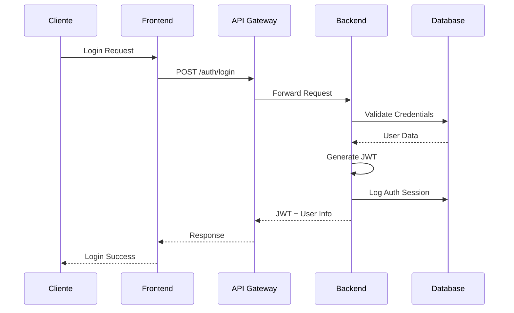
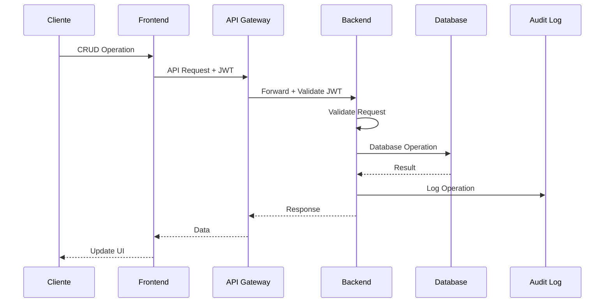

# 🏗️ Arquitectura del Sistema CMPC-Libros

## 📋 Descripción General

El sistema CMPC-Libros está diseñado con una arquitectura moderna de tres capas (3-tier) que separa claramente la presentación, la lógica de negocio y el acceso a datos. Utiliza tecnologías modernas y mejores prácticas de desarrollo para garantizar escalabilidad, mantenibilidad y seguridad.

## 🎯 Principios Arquitectónicos

- **Separación de Responsabilidades**: Cada capa tiene una responsabilidad específica
- **Escalabilidad**: Diseño que permite crecimiento horizontal y vertical
- **Seguridad**: Autenticación JWT, validación de datos y auditoría completa
- **Mantenibilidad**: Código modular y bien documentado
- **Performance**: Optimizaciones en base de datos y caché
- **Observabilidad**: Logging completo y métricas de rendimiento

## 🏗️ Diagrama de Arquitectura

```mermaid
graph TB
    %% Capa de Presentación
    subgraph "🖥️ Capa de Presentación (Frontend)"
        UI[React SPA]
        PWA[Progressive Web App]
        MOBILE[Mobile Responsive]
    end

    %% Capa de API Gateway
    subgraph "🌐 Capa de API Gateway"
        NGINX[Nginx Load Balancer]
        CORS[CORS Handler]
        RATE[Rate Limiting]
    end

    %% Capa de Aplicación
    subgraph "⚙️ Capa de Aplicación (Backend)"
        API[NestJS API Server]
        
        subgraph "🔐 Módulo de Autenticación"
            AUTH[Auth Service]
            JWT[JWT Handler]
            GUARD[Auth Guards]
        end
        
        subgraph "📚 Módulo de Libros"
            BOOKS[Books Service]
            SEARCH[Search Engine]
            EXPORT[Export Service]
        end
        
        subgraph "👥 Módulo de Usuarios"
            USERS[Users Service]
            ROLES[Role Management]
        end
        
        subgraph "📊 Módulo de Auditoría"
            AUDIT[Audit Service]
            LOGS[Logging Interceptor]
        end
        
        subgraph "🛡️ Middleware Global"
            VALID[Validation Pipe]
            EXCEPT[Exception Filter]
            TRANSFORM[Response Transform]
        end
    end

    %% Capa de Datos
    subgraph "🗄️ Capa de Datos"
        DB[(PostgreSQL Database)]
        
        subgraph "📊 Tablas Principales"
            BOOKS_TBL[books]
            USERS_TBL[users]
            AUDIT_TBL[audit_logs]
            SESSIONS_TBL[auth_sessions]
        end
        
        subgraph "🔍 Índices y Optimizaciones"
            IDX_SEARCH[Search Indexes]
            IDX_AUDIT[Audit Indexes]
            IDX_PERF[Performance Indexes]
        end
    end

    %% Servicios Externos
    subgraph "☁️ Servicios Externos"
        GCS[Google Cloud Storage]
        EMAIL[Email Service]
        MONITOR[Monitoring Service]
    end

    %% Flujo de Datos
    UI --> NGINX
    PWA --> NGINX
    MOBILE --> NGINX
    
    NGINX --> CORS
    CORS --> RATE
    RATE --> API
    
    API --> AUTH
    API --> BOOKS
    API --> USERS
    API --> AUDIT
    
    AUTH --> JWT
    AUTH --> GUARD
    
    BOOKS --> SEARCH
    BOOKS --> EXPORT
    
    USERS --> ROLES
    
    AUDIT --> LOGS
    
    API --> VALID
    API --> EXCEPT
    API --> TRANSFORM
    
    API --> DB
    
    DB --> BOOKS_TBL
    DB --> USERS_TBL
    DB --> AUDIT_TBL
    DB --> SESSIONS_TBL
    
    DB --> IDX_SEARCH
    DB --> IDX_AUDIT
    DB --> IDX_PERF
    
    API --> GCS
    API --> EMAIL
    API --> MONITOR

    %% Estilos
    classDef frontend fill:#e1f5fe,stroke:#01579b,stroke-width:2px
    classDef backend fill:#f3e5f5,stroke:#4a148c,stroke-width:2px
    classDef database fill:#e8f5e8,stroke:#1b5e20,stroke-width:2px
    classDef external fill:#fff3e0,stroke:#e65100,stroke-width:2px
    
    class UI,PWA,MOBILE frontend
    class API,AUTH,BOOKS,USERS,AUDIT,VALID,EXCEPT,TRANSFORM backend
    class DB,BOOKS_TBL,USERS_TBL,AUDIT_TBL,SESSIONS_TBL,IDX_SEARCH,IDX_AUDIT,IDX_PERF database
    class GCS,EMAIL,MONITOR external
```

## 🔄 Flujo de Datos

### 1. **Flujo de Autenticación**

### 2. **Flujo de Operación CRUD**

## 🏛️ Patrones Arquitectónicos

### 1. **Patrón MVC (Model-View-Controller)**
- **Model**: Entidades TypeORM y DTOs
- **View**: React Components y páginas
- **Controller**: NestJS Controllers

### 2. **Patrón Repository**
- Abstracción del acceso a datos
- Separación entre lógica de negocio y persistencia
- Facilita testing y mantenimiento

### 3. **Patrón Service Layer**
- Lógica de negocio encapsulada en servicios
- Reutilización de código
- Separación de responsabilidades

### 4. **Patrón Interceptor**
- Logging automático de operaciones
- Transformación de respuestas
- Manejo de errores centralizado

## 🔧 Componentes del Sistema

### **Frontend (React SPA)**
- **Framework**: React 18 con TypeScript
- **UI Library**: Ant Design + Tailwind CSS
- **State Management**: Zustand
- **Routing**: React Router DOM con Lazy Loading
- **HTTP Client**: Fetch API con interceptors
- **Build Tool**: Vite con optimizaciones de bundle
- **Performance**: Lazy loading, code splitting, image optimization
- **SEO**: Meta tags optimizados, Open Graph, Twitter Cards

### **Backend (NestJS API)**
- **Framework**: NestJS con TypeScript
- **ORM**: TypeORM con PostgreSQL
- **Authentication**: JWT + Passport
- **Validation**: class-validator
- **Documentation**: Swagger/OpenAPI
- **Testing**: Jest + Supertest
- **Audit System**: Filtrado híbrido con JOIN y metadata
- **Performance**: Consultas optimizadas con índices estratégicos

### **Base de Datos (PostgreSQL)**
- **Engine**: PostgreSQL 13+
- **ORM**: TypeORM
- **Migrations**: TypeORM Migrations
- **Indexing**: Índices optimizados para búsquedas
- **Soft Delete**: Implementado en todas las entidades
- **Architecture**: Estructura simplificada con campos directos
- **Relations**: UUIDs como claves primarias para escalabilidad
- **Filtering**: Estrategia híbrida para auditoría (JOIN + metadata)

## 🛡️ Seguridad

### **Autenticación y Autorización**
- JWT tokens con expiración configurable
- Refresh tokens para sesiones persistentes
- Guards para protección de endpoints
- Roles y permisos granulares

### **Validación y Sanitización**
- Validación de entrada con class-validator
- Sanitización de datos de usuario
- Protección contra inyección SQL
- CORS configurado apropiadamente

### **Auditoría y Logging**
- Logs completos de todas las operaciones
- Trazabilidad de usuarios y acciones
- Métricas de rendimiento
- Alertas de seguridad

## 📊 Escalabilidad

### **Escalabilidad Horizontal**
- Load balancer con Nginx
- Múltiples instancias de API
- Base de datos con réplicas de lectura
- Caché distribuido (futuro)

### **Escalabilidad Vertical**
- Optimización de consultas SQL
- Índices estratégicos
- Paginación eficiente
- Compresión de respuestas

## ⚡ Optimizaciones de Rendimiento

### **Frontend Optimizations**
- **Lazy Loading**: Componentes y rutas cargados bajo demanda
- **Code Splitting**: Bundle dividido por vendor (React, Ant Design, etc.)
- **Image Optimization**: Lazy loading, async decoding, fallback automático
- **Bundle Optimization**: Terser minification, tree shaking
- **SEO Enhancement**: Meta tags, Open Graph, preconnect, DNS prefetch

### **Backend Optimizations**
- **Query Optimization**: JOIN híbrido con metadata para auditoría
- **Index Strategy**: Índices compuestos para consultas frecuentes
- **Response Caching**: Headers de cache apropiados
- **Database Pooling**: Conexiones optimizadas
- **Error Handling**: Manejo eficiente de errores con fallbacks

### **Database Optimizations**
- **UUID Primary Keys**: Mejor escalabilidad y seguridad
- **Simplified Schema**: Campos directos en lugar de relaciones complejas
- **Strategic Indexing**: Índices en campos de búsqueda frecuente
- **Soft Delete**: Mantenimiento de historial sin impacto en performance
- **Hybrid Filtering**: Combina JOIN y metadata según disponibilidad

## 🔍 Monitoreo y Observabilidad

### **Logging**
- Logs estructurados en JSON
- Niveles de log configurables
- Rotación automática de logs
- Integración con sistemas de monitoreo

### **Métricas**
- Tiempo de respuesta de APIs
- Uso de recursos del sistema
- Errores y excepciones
- Métricas de negocio

### **Health Checks**
- Endpoints de salud del sistema
- Verificación de dependencias
- Alertas automáticas
- Dashboard de monitoreo

## 🚀 Deployment

### **Desarrollo**
- Docker Compose para servicios locales
- Hot reload para desarrollo
- Base de datos de desarrollo
- Variables de entorno configurables

### **Producción**
- Docker containers
- Kubernetes (futuro)
- Load balancer
- Base de datos replicada
- CDN para assets estáticos

## 📈 Roadmap de Arquitectura

### **Fase 1 (Actual)**
- ✅ Arquitectura monolítica modular
- ✅ API REST con documentación
- ✅ Base de datos relacional
- ✅ Autenticación JWT

### **Fase 2 (Próxima)**
- 🔄 Microservicios por dominio
- 🔄 Message queues (Redis/RabbitMQ)
- 🔄 Caché distribuido
- 🔄 API Gateway avanzado

### **Fase 3 (Futuro)**
- 📋 Event Sourcing
- 📋 CQRS (Command Query Responsibility Segregation)
- 📋 GraphQL API
- 📋 Real-time con WebSockets

## 🎯 Decisiones de Diseño

### **¿Por qué NestJS?**
- Framework maduro y bien documentado
- Arquitectura modular y escalable
- Soporte nativo para TypeScript
- Ecosistema rico de módulos
- Excelente para APIs empresariales

### **¿Por qué PostgreSQL?**
- Base de datos relacional robusta
- Soporte para JSON y tipos complejos
- Excelente rendimiento
- ACID compliance
- Herramientas de administración maduras

### **¿Por qué TypeORM?**
- ORM maduro para TypeScript
- Migraciones automáticas
- Decoradores intuitivos
- Soporte para múltiples bases de datos
- Integración perfecta con NestJS

### **¿Por qué React?**
- Biblioteca de UI ampliamente adoptada
- Ecosistema rico de componentes
- Excelente rendimiento
- Herramientas de desarrollo maduras
- Gran comunidad y soporte

## 📚 Referencias

- [NestJS Documentation](https://docs.nestjs.com/)
- [TypeORM Documentation](https://typeorm.io/)
- [React Documentation](https://reactjs.org/docs/)
- [PostgreSQL Documentation](https://www.postgresql.org/docs/)
- [Ant Design Documentation](https://ant.design/docs/react/introduce)

---

**Última actualización**: Enero 2024  
**Versión**: 1.0.0  
**Mantenido por**: Equipo de Desarrollo CMPC
