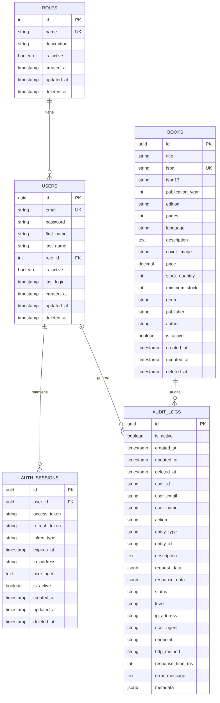

# 🗄️ Modelo Relacional de Base de Datos - CMPC-Libros

## 📋 Descripción General

El modelo de base de datos de CMPC-Libros está diseñado con una arquitectura simplificada y optimizada para un sistema de gestión de inventario de libros. Utiliza PostgreSQL como motor de base de datos y TypeORM como ORM, implementando soft deletes para auditoría completa y trazabilidad de datos. La estructura utiliza UUIDs como claves primarias y campos directos en lugar de relaciones complejas para mejorar el rendimiento y la simplicidad.

## 🎯 Principios de Diseño

- **Arquitectura Simplificada**: Campos directos en lugar de relaciones complejas
- **UUIDs**: Claves primarias UUID para mejor escalabilidad y seguridad
- **Soft Delete**: Eliminación lógica para mantener historial
- **Auditoría**: Trazabilidad completa de todas las operaciones
- **Performance**: Índices estratégicos para consultas optimizadas
- **Filtrado Híbrido**: Combina JOIN con metadata para máxima compatibilidad
- **Integridad**: Constraints y foreign keys para consistencia
- **Escalabilidad**: Diseño que soporta crecimiento de datos

## 🗃️ Diagrama del Modelo Relacional



## 📊 Estructura Detallada de Tablas

### 1. **Tabla `roles`**
```sql
CREATE TABLE roles (
    id SERIAL PRIMARY KEY,
    name VARCHAR(50) UNIQUE NOT NULL,
    description TEXT,
    is_active BOOLEAN DEFAULT TRUE,
    created_at TIMESTAMP DEFAULT CURRENT_TIMESTAMP,
    updated_at TIMESTAMP DEFAULT CURRENT_TIMESTAMP,
    deleted_at TIMESTAMP NULL
);

-- Índices
CREATE INDEX idx_roles_name ON roles(name);
CREATE INDEX idx_roles_active ON roles(is_active);
```

### 2. **Tabla `users`**
```sql
CREATE TABLE users (
    id UUID PRIMARY KEY DEFAULT gen_random_uuid(),
    email VARCHAR(255) UNIQUE NOT NULL,
    password VARCHAR(255) NOT NULL,
    first_name VARCHAR(100) NOT NULL,
    last_name VARCHAR(100) NOT NULL,
    role_id INTEGER REFERENCES roles(id),
    is_active BOOLEAN DEFAULT TRUE,
    last_login TIMESTAMP NULL,
    created_at TIMESTAMP DEFAULT CURRENT_TIMESTAMP,
    updated_at TIMESTAMP DEFAULT CURRENT_TIMESTAMP,
    deleted_at TIMESTAMP NULL
);

-- Índices
CREATE INDEX idx_users_email ON users(email);
CREATE INDEX idx_users_active ON users(is_active);
CREATE INDEX idx_users_role ON users(role_id);
CREATE INDEX idx_users_deleted ON users(deleted_at);
CREATE INDEX idx_users_created ON users(created_at);
```

**Características:**
- **PK**: `id` (auto-increment)
- **UK**: `email` (único)
- **Campos**: Información básica del usuario
- **Seguridad**: Password hasheado con bcrypt
- **Sesiones**: Refresh token para JWT
- **Auditoría**: Soft delete implementado

### 3. **Tabla `books`**
```sql
CREATE TABLE books (
    id UUID PRIMARY KEY DEFAULT gen_random_uuid(),
    title VARCHAR(255) NOT NULL,
    isbn VARCHAR(20) UNIQUE,
    isbn13 VARCHAR(20),
    publication_year INTEGER,
    edition VARCHAR(50),
    pages INTEGER,
    language VARCHAR(10) DEFAULT 'es',
    description TEXT,
    cover_image VARCHAR(500),
    price DECIMAL(10,2) NOT NULL,
    stock_quantity INTEGER DEFAULT 0,
    minimum_stock INTEGER DEFAULT 5,
    genre VARCHAR(100) NOT NULL,
    publisher VARCHAR(255) NOT NULL,
    author VARCHAR(255) NOT NULL,
    is_active BOOLEAN DEFAULT TRUE,
    created_at TIMESTAMP DEFAULT CURRENT_TIMESTAMP,
    updated_at TIMESTAMP DEFAULT CURRENT_TIMESTAMP,
    deleted_at TIMESTAMP NULL
);

-- Índices
CREATE INDEX idx_books_title ON books(title);
CREATE INDEX idx_books_author ON books(author);
CREATE INDEX idx_books_publisher ON books(publisher);
CREATE INDEX idx_books_genre ON books(genre);
CREATE INDEX idx_books_isbn ON books(isbn);
CREATE INDEX idx_books_active ON books(is_active);
CREATE INDEX idx_books_deleted ON books(deleted_at);
CREATE INDEX idx_books_created ON books(created_at);
CREATE INDEX idx_books_price ON books(price);
CREATE INDEX idx_books_stock ON books(stock_quantity);
```

### 4. **Tabla `auth_sessions`**
```sql
CREATE TABLE auth_sessions (
    id UUID PRIMARY KEY DEFAULT gen_random_uuid(),
    user_id UUID REFERENCES users(id) ON DELETE CASCADE,
    access_token VARCHAR(500) NOT NULL,
    refresh_token VARCHAR(500) NOT NULL,
    token_type VARCHAR(20) DEFAULT 'Bearer',
    expires_at TIMESTAMP NOT NULL,
    ip_address INET,
    user_agent TEXT,
    is_active BOOLEAN DEFAULT TRUE,
    created_at TIMESTAMP DEFAULT CURRENT_TIMESTAMP,
    updated_at TIMESTAMP DEFAULT CURRENT_TIMESTAMP,
    deleted_at TIMESTAMP NULL
);

-- Índices
CREATE INDEX idx_auth_sessions_user ON auth_sessions(user_id);
CREATE INDEX idx_auth_sessions_active ON auth_sessions(is_active);
CREATE INDEX idx_auth_sessions_expires ON auth_sessions(expires_at);
```

**Características:**
- **PK**: `id` (UUID para mejor escalabilidad)
- **Campos**: Información completa del libro con campos directos
- **Búsqueda**: Índices en campos de búsqueda frecuente
- **Stock**: Control de inventario con stock mínimo
- **Precio**: Decimal para precisión monetaria
- **Auditoría**: Soft delete implementado
- **Arquitectura**: Campos directos (genre, publisher, author) para simplicidad

### 5. **Tabla `audit_logs`**
```sql
CREATE TABLE audit_logs (
    id UUID PRIMARY KEY DEFAULT gen_random_uuid(),
    is_active BOOLEAN DEFAULT TRUE,
    created_at TIMESTAMP DEFAULT CURRENT_TIMESTAMP,
    updated_at TIMESTAMP DEFAULT CURRENT_TIMESTAMP,
    deleted_at TIMESTAMP NULL,
    user_id VARCHAR(255) NOT NULL,
    user_email VARCHAR(255) NOT NULL,
    user_name VARCHAR(255) NOT NULL,
    action VARCHAR(100) NOT NULL,
    entity_type VARCHAR(100) NOT NULL,
    entity_id VARCHAR(255),
    description TEXT,
    request_data JSONB,
    response_data JSONB,
    status VARCHAR(20) NOT NULL,
    level VARCHAR(20) NOT NULL,
    ip_address INET,
    user_agent TEXT,
    endpoint VARCHAR(500),
    http_method VARCHAR(10),
    response_time_ms INTEGER,
    error_message TEXT,
    metadata JSONB
);

-- Índices compuestos para consultas frecuentes
CREATE INDEX idx_audit_user_created ON audit_logs(user_id, created_at);
CREATE INDEX idx_audit_entity ON audit_logs(entity_type, entity_id);
CREATE INDEX idx_audit_action_created ON audit_logs(action, created_at);
CREATE INDEX idx_audit_status_created ON audit_logs(status, created_at);
CREATE INDEX idx_audit_level_created ON audit_logs(level, created_at);
CREATE INDEX idx_audit_endpoint ON audit_logs(endpoint);
CREATE INDEX idx_audit_created ON audit_logs(created_at);
CREATE INDEX idx_audit_active ON audit_logs(is_active);
CREATE INDEX idx_audit_deleted ON audit_logs(deleted_at);
```

**Características:**
- **PK**: `id` (auto-increment)
- **Auditoría**: Registro completo de operaciones
- **JSONB**: Datos flexibles en formato JSON
- **Performance**: Índices compuestos para consultas
- **Trazabilidad**: IP, User-Agent, timestamps
- **Métricas**: Tiempo de respuesta y estado

## 🔍 Índices y Optimizaciones

### **Índices de Búsqueda**
```sql
-- Búsqueda de libros por texto
CREATE INDEX idx_books_search ON books USING gin(to_tsvector('spanish', title || ' ' || author || ' ' || publisher));

-- Búsqueda en audit logs
CREATE INDEX idx_audit_search ON audit_logs USING gin(to_tsvector('spanish', description || ' ' || user_name));
```

### **Índices de Performance**
```sql
-- Consultas frecuentes de auditoría
CREATE INDEX idx_audit_user_recent ON audit_logs(user_id, created_at DESC) WHERE is_active = true;
CREATE INDEX idx_audit_errors ON audit_logs(level, created_at) WHERE level = 'ERROR';
CREATE INDEX idx_audit_slow_queries ON audit_logs(response_time_ms, created_at) WHERE response_time_ms > 1000;
```

### **Índices de Soft Delete**
```sql
-- Filtrar registros activos
CREATE INDEX idx_books_active_only ON books(id) WHERE is_active = true AND deleted_at IS NULL;
CREATE INDEX idx_users_active_only ON users(id) WHERE is_active = true AND deleted_at IS NULL;
CREATE INDEX idx_audit_active_only ON audit_logs(id) WHERE is_active = true AND deleted_at IS NULL;
```

## 🔗 Relaciones y Constraints

### **Foreign Keys**
```sql
-- Relación users -> audit_logs (implícita por user_id)
-- No se implementa FK física para flexibilidad en auditoría
-- La integridad se mantiene a nivel de aplicación
```

### **Constraints de Integridad**
```sql
-- Validaciones de datos
ALTER TABLE books ADD CONSTRAINT chk_books_price_positive CHECK (price >= 0);
ALTER TABLE books ADD CONSTRAINT chk_books_stock_positive CHECK (stock >= 0);
ALTER TABLE books ADD CONSTRAINT chk_books_title_not_empty CHECK (length(trim(title)) > 0);
ALTER TABLE books ADD CONSTRAINT chk_books_author_not_empty CHECK (length(trim(author)) > 0);

-- Validaciones de audit_logs
ALTER TABLE audit_logs ADD CONSTRAINT chk_audit_response_time_positive CHECK (response_time_ms >= 0);
ALTER TABLE audit_logs ADD CONSTRAINT chk_audit_action_valid CHECK (action IN ('CREATE', 'READ', 'UPDATE', 'DELETE', 'LOGIN', 'LOGOUT', 'EXPORT', 'INVENTORY_ADDED', 'INVENTORY_UPDATED', 'INVENTORY_REMOVED', 'INVENTORY_VIEWED', 'INVENTORY_SEARCHED'));
ALTER TABLE audit_logs ADD CONSTRAINT chk_audit_status_valid CHECK (status IN ('SUCCESS', 'FAILURE', 'PENDING'));
ALTER TABLE audit_logs ADD CONSTRAINT chk_audit_level_valid CHECK (level IN ('INFO', 'WARNING', 'ERROR', 'DEBUG'));
```

## 📊 Tipos de Datos y Consideraciones

### **Tipos de Datos Utilizados**
- **SERIAL**: Auto-increment para PKs
- **VARCHAR**: Texto de longitud variable con límites
- **TEXT**: Texto largo sin límite
- **DECIMAL**: Precisión monetaria para precios
- **BOOLEAN**: Valores true/false
- **TIMESTAMP**: Fechas y horas
- **JSONB**: Datos JSON binarios para flexibilidad
- **INTEGER**: Números enteros

### **Consideraciones de Performance**
- **Índices estratégicos** en campos de búsqueda frecuente
- **Índices compuestos** para consultas complejas
- **Índices parciales** para filtros comunes
- **JSONB** para datos flexibles con índices GIN
- **Soft delete** con índices en deleted_at

## 🔄 Migraciones y Versionado

### **Estructura de Migraciones**
```typescript
// Ejemplo de migración
export class InitialMigration1234567890 implements MigrationInterface {
    name = 'InitialMigration1234567890'

    public async up(queryRunner: QueryRunner): Promise<void> {
        // Crear tablas
        await queryRunner.createTable(/* ... */);
        
        // Crear índices
        await queryRunner.createIndex(/* ... */);
        
        // Crear constraints
        await queryRunner.createCheckConstraint(/* ... */);
    }

    public async down(queryRunner: QueryRunner): Promise<void> {
        // Revertir cambios
        await queryRunner.dropTable(/* ... */);
    }
}
```

### **Comandos de Migración**
```bash
# Generar migración
npm run migration:generate -- src/migrations/NombreMigracion

# Ejecutar migraciones
npm run migration:run

# Revertir migración
npm run migration:revert

# Ver estado de migraciones
npm run typeorm -- migration:show
```

## 🛡️ Seguridad y Auditoría

## ⚡ Optimizaciones de Rendimiento

### **Filtrado Híbrido para Auditoría**
El sistema implementa una estrategia híbrida que combina JOIN con metadata para máxima compatibilidad:

```sql
-- Estrategia híbrida: JOIN + metadata
SELECT log.*, book.title, book.genre, book.publisher, book.author
FROM audit_logs log
LEFT JOIN books book ON book.id::text = log.entity_id
WHERE log.deleted_at IS NULL
  AND (
    book.genre ILIKE '%Tecnología%' OR 
    log.metadata->>'genre' ILIKE '%Tecnología%'
  );
```

**Ventajas:**
- **Compatibilidad**: Funciona con logs que tienen `entity_id` y con los que solo tienen `metadata`
- **Performance**: JOIN directo cuando es posible, fallback a metadata
- **Flexibilidad**: Soporte para diferentes tipos de logs de auditoría

### **Índices Estratégicos**
```sql
-- Índices compuestos para consultas frecuentes
CREATE INDEX idx_audit_user_created ON audit_logs(user_id, created_at);
CREATE INDEX idx_audit_entity ON audit_logs(entity_type, entity_id);
CREATE INDEX idx_audit_action_created ON audit_logs(action, created_at);

-- Índices para filtrado de libros
CREATE INDEX idx_books_genre ON books(genre);
CREATE INDEX idx_books_publisher ON books(publisher);
CREATE INDEX idx_books_author ON books(author);

-- Índices para soft delete
CREATE INDEX idx_books_deleted ON books(deleted_at);
CREATE INDEX idx_audit_deleted ON audit_logs(deleted_at);
```

### **UUIDs para Escalabilidad**
- **Ventajas**: Mejor distribución, no secuencial, más seguro
- **Performance**: Índices B-tree optimizados para UUIDs
- **Escalabilidad**: Soporte para múltiples instancias sin conflictos

## 🔧 Implementación Técnica

### **Soft Delete Implementation**
```typescript
// Entidad base con soft delete
export abstract class BaseEntity {
    @DeleteDateColumn({ type: 'timestamp', nullable: true })
    @Index()
    deleted_at: Date;

    @Column({ type: 'boolean', default: true })
    @Index()
    is_active: boolean;

    softDelete(): void {
        this.deleted_at = new Date();
        this.is_active = false;
    }

    restore(): void {
        this.deleted_at = null;
        this.is_active = true;
    }
}
```

### **Auditoría Automática**
```typescript
// Interceptor de auditoría
@Injectable()
export class LoggingInterceptor implements NestInterceptor {
    intercept(context: ExecutionContext, next: CallHandler): Observable<any> {
        const request = context.switchToHttp().getRequest();
        const response = context.switchToHttp().getResponse();
        
        return next.handle().pipe(
            tap(() => {
                this.auditService.log({
                    user_id: request.user?.id,
                    action: this.getAction(request),
                    entity_type: this.getEntityType(request),
                    request_data: this.sanitizeRequest(request),
                    response_data: this.sanitizeResponse(response),
                    ip_address: request.ip,
                    user_agent: request.get('User-Agent'),
                    endpoint: request.url,
                    http_method: request.method,
                    response_time_ms: Date.now() - request.startTime
                });
            })
        );
    }
}
```

## 📈 Escalabilidad y Performance

### **Estrategias de Optimización**
1. **Índices estratégicos** para consultas frecuentes
2. **Paginación** en todas las consultas de listado
3. **Soft delete** con índices para filtros
4. **JSONB** para datos flexibles con índices GIN
5. **Constraints** para integridad de datos
6. **Particionado** (futuro) para tablas grandes

### **Consultas Optimizadas**
```sql
-- Consulta optimizada para búsqueda de libros
SELECT b.*, 
       ts_rank(to_tsvector('spanish', b.title || ' ' || b.author), plainto_tsquery('spanish', $1)) as rank
FROM books b
WHERE b.is_active = true 
  AND b.deleted_at IS NULL
  AND to_tsvector('spanish', b.title || ' ' || b.author) @@ plainto_tsquery('spanish', $1)
ORDER BY rank DESC, b.created_at DESC
LIMIT $2 OFFSET $3;

-- Consulta optimizada para auditoría por usuario
SELECT al.*
FROM audit_logs al
WHERE al.user_id = $1
  AND al.is_active = true
  AND al.deleted_at IS NULL
  AND al.created_at >= $2
  AND al.created_at <= $3
ORDER BY al.created_at DESC
LIMIT $4 OFFSET $5;
```

## 🔧 Mantenimiento y Monitoreo

### **Consultas de Monitoreo**
```sql
-- Tamaño de tablas
SELECT 
    schemaname,
    tablename,
    pg_size_pretty(pg_total_relation_size(schemaname||'.'||tablename)) as size
FROM pg_tables 
WHERE schemaname = 'public'
ORDER BY pg_total_relation_size(schemaname||'.'||tablename) DESC;

-- Índices no utilizados
SELECT 
    schemaname,
    tablename,
    indexname,
    idx_tup_read,
    idx_tup_fetch
FROM pg_stat_user_indexes 
WHERE idx_tup_read = 0
ORDER BY schemaname, tablename, indexname;

-- Consultas lentas
SELECT 
    query,
    calls,
    total_time,
    mean_time,
    rows
FROM pg_stat_statements 
WHERE mean_time > 1000
ORDER BY mean_time DESC
LIMIT 10;
```

### **Limpieza de Datos**
```sql
-- Limpiar logs antiguos (mantener últimos 6 meses)
DELETE FROM audit_logs 
WHERE created_at < NOW() - INTERVAL '6 months'
  AND level = 'INFO'
  AND status = 'SUCCESS';

-- Vacuum y analyze
VACUUM ANALYZE;
```

## 📚 Referencias y Recursos

### **Documentación Técnica**
- [PostgreSQL Documentation](https://www.postgresql.org/docs/)
- [TypeORM Documentation](https://typeorm.io/)
- [JSONB Performance](https://www.postgresql.org/docs/current/datatype-json.html)

### **Mejores Prácticas**
- [Database Design Best Practices](https://www.postgresql.org/docs/current/ddl.html)
- [Indexing Strategies](https://www.postgresql.org/docs/current/indexes.html)
- [Performance Tuning](https://www.postgresql.org/docs/current/performance-tips.html)

---

**Última actualización**: Enero 2024  
**Versión del esquema**: 1.0.0  
**Mantenido por**: Equipo de Desarrollo CMPC
